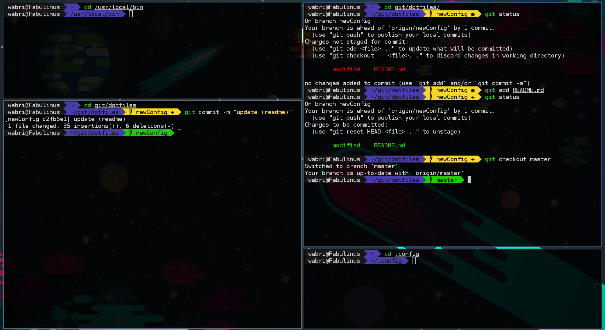

# Dotfiles

## Some details
* OS: Debian 9
* WM: I3
* Terminal: rxvt-unicode (URxvt)
* File Manager: vifm for terminal
* Launcher: Rofi
* Editor: Vim, VSCode
* Browser: Firefox

## Index

0. [I3wm](#i3)
1. [polybar](#polybar)
2. [Urxvt](#urxvt)
3. [Vim](#vim)
4. [Vifm](#vifm)
5. [Visual Studio Code](#vscode)
6. [Install](#install)
7. [WallPaper](#wallpaper)

## I3

This configuration is Vim oriented (move keys with h-j-k-l).
You can find the config here -> [file](home/.config/i3/config)

### Preview

### Keyboard
I use the windows key as my main mod key.

* `super + enter` -> new terminal
* `super + d` -> launch rofi
* `super + shift + q` -> close container
* `super + [1-0]` -> change workspace
* `super + shift + [1-0]` -> move container to workspace
* `super + g` -> toggle split mode
* `super + f` -> toggle fullscreen
* `super + w` -> layout tabbed
* `super + e` -> toggle layout split
* `super + r` -> resize mode
* `super + Shift + o` -> toggle floating
* `super + o` -> focus floating
* `super + h/l` -> move right/left container view
* `super + j/k` -> move down/up container view
* `super + Shift + h/j/k/l` -> move container left/down/up/right
* `super + p` -> system control mode (logout, suspend, hibernate, reboot, poweroff
* `super + Shift + x` -> lock screen
* `print` -> grab a screenshoot of the active window
* `super + print` -> select area to grab to screenshot
* `super + Shift + print` -> grab a screenshoot of the entire screen
* `XF86Tools` -> open with vim the config file
* `XF86Display` -> open arandr for graphical management of monitor view
* `super + backslash` -> open vifm in the home directory
* `super + Shift + comma` -> create a new file and edit with vim
* `super + Shift + ograve` -> open mailspring mail client

## Polybar

You can find the config here -> [file](home/.config/polybar/config)

### Preview

### Modules
* i3
* cpu
* memory
* temperature
* filesystem
* spotify
* wireless-network
* wired-network
* pulseaudio
* battery
* date

## Urxvt

You can find the Xresources here -> [file](home/.Xresources)

## Preview

### Keyboard
* `Ctrl+k` -> increase the font size
* `Ctrl+j` -> decrease the font size
* `Ctrl+Shift+c` -> copy to the clipboard
* `Ctrl+Shift+v` -> paste from the clipboard

### Plugin
* [font-size](https://github.com/johntyree/urxvt-perls)
* [url-select](https://github.com/johntyree/urxvt-perls)

## Vim

You can find the config here -> [file](home/.vimrc)

### Preview

### Keyboard
###### To abilitate the copy and paste to clipboard you need to install vim-gnome
* `Space+f` -> abilitate the goyo text viewer
* `Ctrl+m` -> open the markdown preview on firefox
* `Ctrl+n` -> open the nerd tree
* `<F2>` -> copy to the clipboard
* `<F3>` -> paste from the clipboard

### Plugin
###### I'm using [plugged](https://github.com/junegunn/vim-plug)
* [i3-vim-syntax](github.com/potatoesMaster/i3-vim-syntax)
* [vim-sensible](github.com/tpope/vim-sensible)
* [jedi-vim](github.com/davidhalter/jedi-vim)
* [gojo.vim](github.com/junegunn/goyo.vim)
* [vim-markdown-preview](github.com/JamshedVesuna/vim-markdown-preview)
* [nerdtree](github.com/scrooloose/nerdtree)
* [nerdtree-git-plugin](github.com/Xuyuanp/nerdtree-get-plugin)

## Vifm

You can find the config here -> [file](home/.config/vifm/vifmrc)

### Preview

### Keyboard
To see all of the keyboard shortcut go to cheatsheets: [vifm.info/cheatsheets.shtml](https://vifm.info/cheatsheets.shtml):

## VSCode

### Preview

### Keyboard
###### To see the keyboard setup you can read the [keybinding.json](.config/Code/User/keybindings.json).
* All the Vim keybinding are set up with the VSCodeVim plugin
* under develop

### Plugin

* [Vim](https://github.com/VSCodeVim/Vim)
* [markdownlint](https://github.com/DavidAnson/vscode-markdownlint)
* [Python](https://github.com/Microsoft/vscode-python)

To install this plugins you can use the script [install_extension.sh](.config/Code/install_extension.sh)

## Rofi

### Preview

### Keyboard

###### ***You can see all the configuration [here](home/.config/rofi/config)***
###### ***This configuration is vim oriented***

* `Alt + Shift + d` -> Clear input line
* `Alt + Shift + i` -> Beginning of the line
* `Alt + Shift + a` -> End of line
* `Alt + b` -> Move back one word
* `Alt + w` -> Move forward one word
* `Alt + h` -> Move back one char
* `Alt + l` -> Move forward one char
* `Alt + Shift + c` -> Delete till the end of the line
* `Alt + Shift + s` -> Delete till the start of the line
* `Control + Tab` -> Switch to the next mode
* `Control + Shift + Tab` -> Switch to the previous mode
* `Alt + Shift + h` -> Go to the previous column
* `Alt + Shift + l` -> Go to the next column
* `Alt + Shift + l` -> Go to the next column
* `Control + Space` -> Set selected item as input text
* `Alt + s` -> Take a screenshot of the rofi window
* `Escape` -> Quit rofi

## Install

###### This install is tested only for Debian 9

First of all you need to be in the sudoers:

    $ usermod -aG sudo <username>

Download or clone one of the release and run:

    git clone https://github.com/wabri/dotfiles
    cd dotfiles
    make all

Now reboot and prey.

## WallPaper

